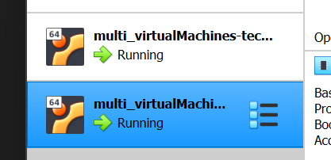

# Setting up mutli-machine Vagrant

## Step 1
Setup a vagrant file by entering the following command in bash:
- `vagrant init ubuntu/xenial64`

The following file should appear in you directory: 
- 

## Step 2
Now enter this code into you vagrant file:
- 
```
Vagrant.configure("2") do |config|
  config.vm.define "app" do |app|
    app.vm.box = "ubuntu/bionic64"
    app.vm.network "private_network", ip: "192.168.10.100"
   
    app.vm.synced_folder "app", "/home/vagrant/app"
    app.vm.provision "shell", path: "provision.sh", privileged: false
  end

  config.vm.define "database" do |database|
    database.vm.box = "ubuntu/bionic64"
    database.vm.network "private_network", ip: "192.168.10.150"
    
    database.vm.synced_folder "environment", "/home/vagrant/environment"
  end
end
```

## Step 3
Include a `provision.sh` shell script to automatically install all the tools needed when we create our virtual machines:
```
#!/bin/bash

# Update & Upgrade 
sudo apt-get update -y
sudo apt-get upgrade -y

# Install nginx
sudo apt-get install nginx -y

# Enable/Start nginx
sudo systemctl enable nginx -y

# Install node js specific version
sudo apt-get install python-software-properties
curl -sL https://deb.nodesource.com/setup_12.x | sudo -E bash -
sudo apt-get install nodejs -y

# Install pm2
sudo npm install pm2 -g
```

## Step 4
- Enter the command `vagrant up` to push the info to virtual box.
- Have two bash terminals open and enter the 2 different VMs by using `vagrant ssh app` & `vagrant ssh database`
- 

## Step 5
- Enter you database machine and install the database by following the commands below:
```
# Add the Key:

sudo apt-key adv --keyserver hkp://keyserver.ubuntu.com:80 --recv D68FA50FEA312927  # A confirmation of import will be displayed

# Make Sure its Working
echo "deb https://repo.mongodb.org/apt/ubuntu xenial/mongodb-org/3.2 multiverse" | sudo tee /etc/apt/sources.list.d/mongodb-org-3.2.list

# It will display back - deb https://repo.mongodb.org/apt/ubuntu xenial/mongodb-org/3.2 multiverse

# Update and Upgrade the system
sudo apt-get update -y
sudo apt-get upgrade -y

# Install database - sudo apt-get install mongodb-org=3.2.20 -y
sudo apt-get install -y mongodb-org=3.2.20 mongodb-org-server=3.2.20 mongodb-org-shell=3.2.20 mongodb-org-mongos=3.2.20 mongodb-org-tools=3.2.20
```

## Step 6
- Start and enable your database:
```
sudo systemctl start mongod
sudo systemctl enable mongod
```
```
# If successfully enabled, we will receive the following message in the console.
Created symlink /etc/systemd/system/multi-user.target.wants/mongod.service -> /lib/systemd/system/mongod.service.
```

## Step 7
- Go onto `mongod.conf` file and change the bindIp to allow ip address to access the database.
- Change it to the following:
```
# network interfaces
net:
 port: 27017
 bindIp: 0.0.0.0 
```

## Step 8
- Restart your database with the new configurations
```
sudo systemctl restart mongod
sudo systemctl enable mongod
```

## Step 9
- Switch to you app machine and create an environment variable to allow access to the database:
```
export DB_HOST=mongodb://192.168.10.150:27017/posts
```
- You can to see if this is created with the following command -> `printenv DB_HOST`

## Step 10
- Run npm start (This will access the webpage with no data as we have not seeded the database yet)
- .png)

## Step 11
- In order to render the data onto the webpage we need to run the command:
```
node seeds/seed.js
```
- If successful the output should be:
```
# We should be able to see these message if it works.   
Database Cleared
Database Seeded
```
- Now run the command `npm start` and we should see all the data on the webpage
.png)

## Possible blocker
- If you are trying to `npm start` after compeleting all these steps then an error may be outputted as we have been constantly stopping and starting our node server. To fix this we need to kill that process.
- First find the PID number of the proccess by using the command `sudo lsof -i :3000`
- Then kill it by using the command `kill -9 <PID>` by replacing `<PID>` with the actual number.
- Now we can run `npm start` and it should begin to work.


# Setting up reverse proxy
